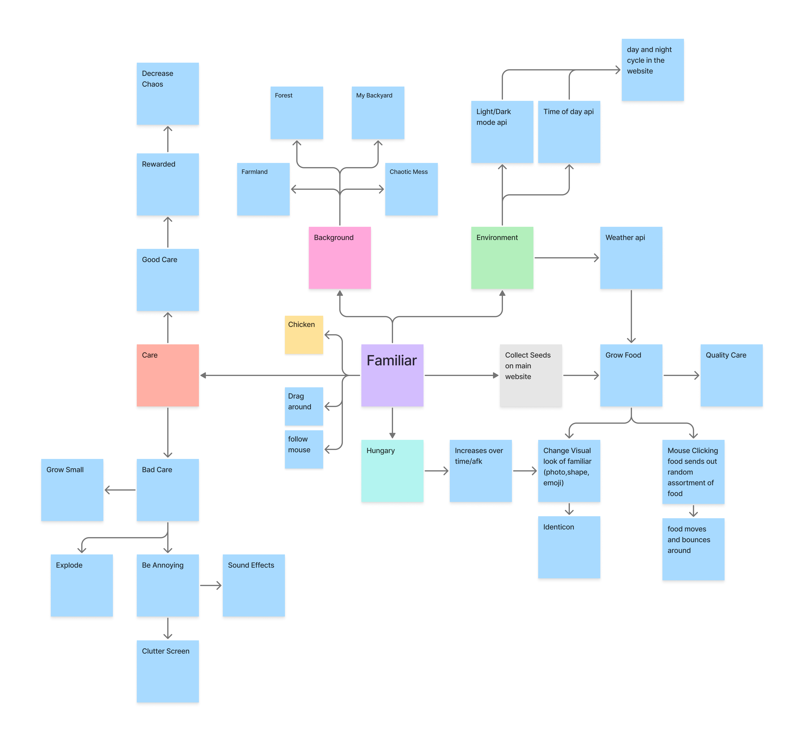
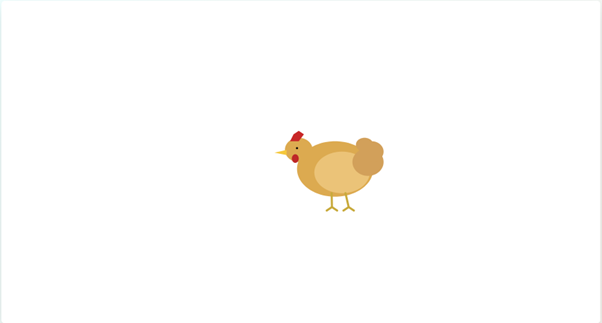
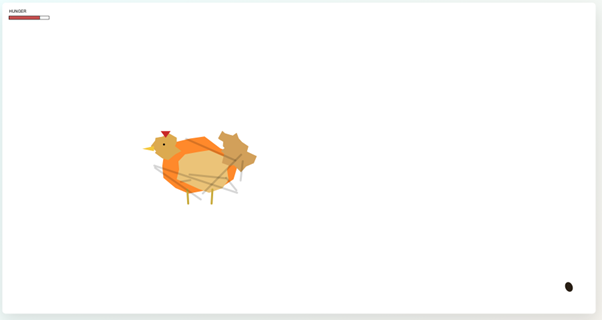
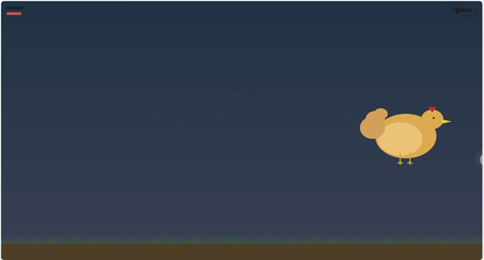
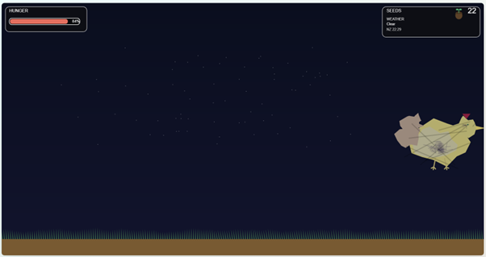
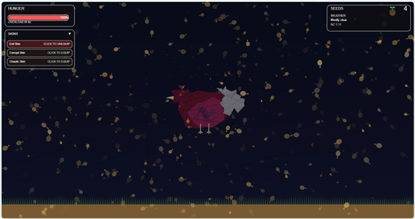

## Familiar – Orlando

My intention is to design and build a digital familiar. The familiar takes the form of a chicken that appears normal at first, but gradually transforms into a monster when neglected. To keep the chicken alive, the user must feed it. Seeds can be planted and grown to provide food. Loud noises will startle the chicken, causing its hunger to increase faster. If the chicken is poorly cared for, it will eventually overload and destroy itself. However, consistent care rewards the user with cosmetic upgrades. The familiar can be accessed through my Project 1 website by clicking on a spiral portal.

## AI Use
I used Microsoft Copilot as my main tool, describing what I wanted through prompts. AI was used to help create the structure of my familiar. Copilot would generated code and helped me implement features in without breaking existing functionality.

## Progress

**02.04.26** – At this stage, I had a rough idea of my concept so I created a brainstorm outlining what I wanted to build. The main idea was a familiar that required care and have negative consequences if neglected. I was inspired by the 2012 Furby I had as a child where good care resulted in a friendly personality but overfeeding or mistreatment caused it to become “evil.”

**13.04.26** – I began by creating a chicken model for my familiar. After that I started adding functionality. I used Microsoft Copilot to help generate animations for movement and pecking. It was difficult to get the animations right as issues like clipping and unnatural movement kept occurring (for example the head would move independently while the body stayed stiff). After refining it, I reached a result I was happy with. I also added random walking behaviour and the ability to drag the chicken around the screen.

**16.04.26** – I added a hunger bar that decreases over time along with a seed icon in the bottom right. At this stage, seeds were infinite, and dragging one onto the chicken would reduce hunger. Since my website has a chaotic theme, I introduced a system where the chicken becomes increasingly distorted as its hunger rises.

**23.04.26** – I expanded the seed system by adding soil and grass allowing seeds to be planted and grown. I repositioned the seeds to the top right and added a mechanic where one planted seed grows into a plant that produces two seeds. I also implemented a day/night cycle based on real-world time in New Zealand. To introduce consequences for neglect, I added an overload system when the hunger reaches 100% the chicken begins to overload cluttering the screen before eventually exploding.

**27.04.26** – At this stage, I wanted to improve the visual design of the hunger and seed systems. I added a UI box with a redesigned seed icon to make the interface look cleaner and more organised. The hunger bar was updated to save progress when leaving and returning to the website and it now continues to increase when the user is alt-tabbed. I also introduced a weather system where real-time rain is reflected on the familiar page. Additionally I updated the chicken’s appearance so that it becomes more corrupted and evil as the hunger bar increases.

**30.04.26** – I realised there was little motivation for the user to care for the chicken, so I implemented a reward system. If the chicken is kept alive for 5 minutes, 15 minutes and 1 hour the user unlocks cosmetic skins. Failing to maintain the chicken resets this progress. I also added another interaction involving sound if the environment is too loud, the chicken becomes startled and its hunger increases faster. I linked access to this familiar through my Project 1 website.

Most of the issues I encountered during this stage came from incorrectly placing code generated by Microsoft Copilot, which often caused parts of the system to break. This required additional time spent troubleshooting. These problems occurred more frequently due to the increased complexity and larger amount of code compared to my Project 1 website.